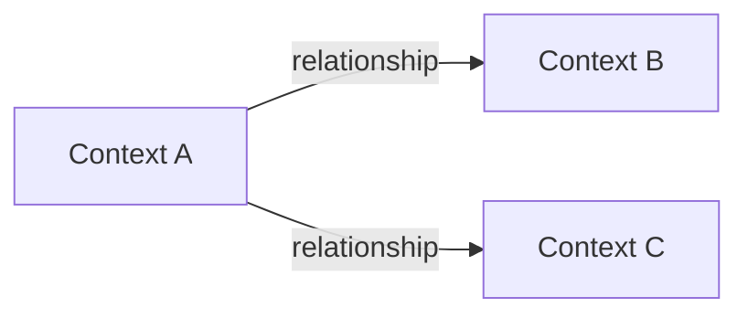
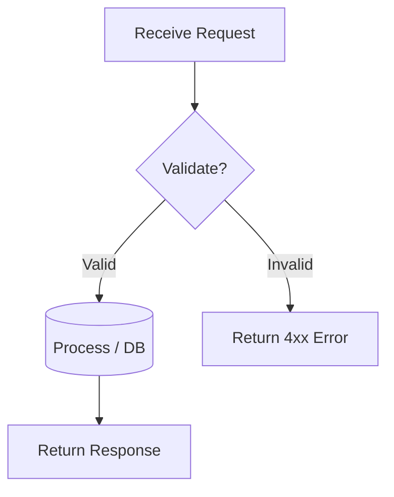

# Analysis and Design — Domain-Driven Design Approach

**References:**
1. *Domain-Driven Design: Tackling Complexity in the Heart of Software* — Eric Evans
2. *Microservices Patterns: With Examples in Java* — Chris Richardson
3. *Bài tập — Phát triển phần mềm hướng dịch vụ* — Hung Dang (available in Vietnamese)

---

## Part 1 — Domain Discovery

### 1.1 Business Process Definition

Describe or diagram the high-level Business Process to be automated.

- **Domain**: E-learning & Education Technology.
- **Business Process**: Online course enrollment and automated notification system.
- **Actors**: Student, Administrator, System.
- **Scope**: User authentication, Profile management, Course CRUD, Order placement, Payment processing, and Notification delivery.

**Process Diagram:**

*(Insert BPMN, flowchart, or image into `docs/asset/` and reference here)*

### 1.2 Existing Automation Systems
| System Name | Type | Current Role | Interaction Method |
|-------------|------|--------------|-------------------|
| None | N/A | The process is currently performed manually. | N/A |

### 1.3 Non-Functional Requirements

| Requirement | Description |
|----------------|-------------|
| Performance | Average response time < 500ms for internal service calls. |
| Security | Stateless authentication using JWT; Role-based access control (RBAC). |
| Scalability | Granular scaling of Course and Order services during high-traffic sales. |
| Availability | High availability using Eureka Service Discovery and Resilience4j. |

---

## Part 2 — Strategic Domain-Driven Design

### 2.1 Event Storming — Domain Events

List Domain Events in chronological order as they occur in the business process.
Format: past tense (e.g., "OrderPlaced", "PaymentReceived").

| # | Domain Event | Triggered By | Description |
|---|-------------|--------------|-------------|
|   |             |              |             |

### 2.2 Commands and Actors

What Commands trigger those Domain Events, and who issues them?

| Command | Actor | Triggers Event(s) |
|---------|-------|--------------------|
|         |       |                    |

### 2.3 Aggregates

Group related Commands and Events around the business entities (Aggregates) they operate on.

| Aggregate | Commands | Domain Events | Owned Data |
|-----------|----------|---------------|------------|
|           |          |               |            |

### 2.4 Bounded Contexts

Draw boundaries around Aggregates that belong to the same business context. Each Bounded Context = one potential service.

| Bounded Context | Aggregates | Responsibility |
|-----------------|------------|----------------|
|                 |            |                |

### 2.5 Context Map

Show relationships between Bounded Contexts.

**Relationship types:** Upstream/Downstream, Customer/Supplier, Conformist, Anti-Corruption Layer (ACL), Shared Kernel, Open Host Service (OHS), Published Language.

| Upstream | Downstream | Relationship Type |
|----------|------------|-------------------|
|          |            |                   |

---

## Part 3 — Service-Oriented Design

### 3.1 Uniform Contract Design

Service Contract specification for each Bounded Context / service.
Full OpenAPI specs:
- [`docs/api-specs/user-service.yaml`](docs/api-specs/user-service.yaml)
- [`docs/api-specs/profile-service.yaml`](docs/api-specs/profile-service.yaml)
- [`docs/api-specs/course-service.yaml`](docs/api-specs/course-service.yaml)
- [`docs/api-specs/order-service.yaml`](docs/api-specs/order-service.yaml)
- [`docs/api-specs/payment-service.yaml`](docs/api-specs/payment-service.yaml)
- [`docs/api-specs/notification-service.yaml`](docs/api-specs/notification-service.yaml)

**Base URL**: `http://localhost:8000/api/v1`

**Service A:**

| Endpoint | Method | Media Type | Response Codes |
|----------|--------|------------|----------------|
|          |        |            |                |

**Service B:**

| Endpoint | Method | Media Type | Response Codes |
|----------|--------|------------|----------------|
|          |        |            |                |

### 3.2 Service Logic Design

Internal processing flow for each service.

**Service A:**

**Service B:**

