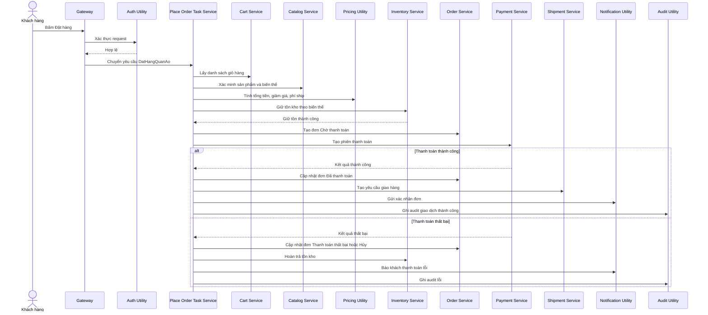
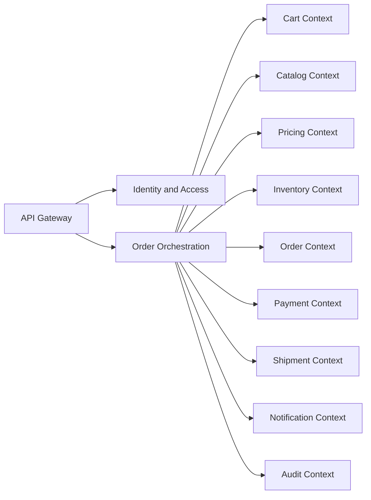
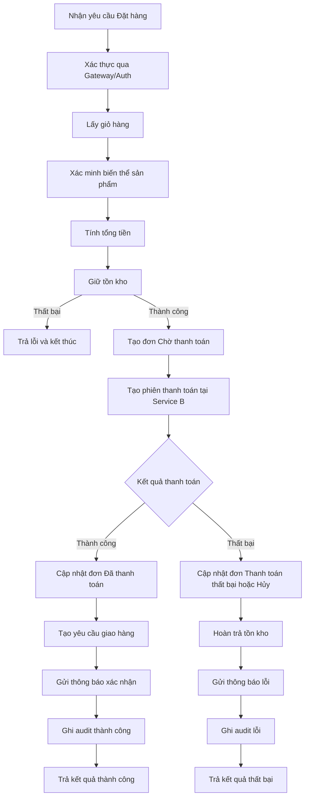
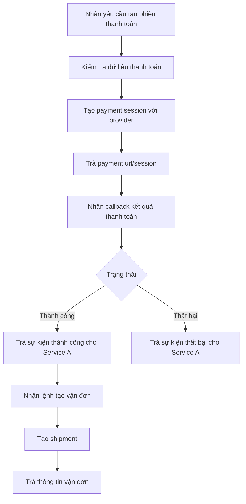

# Phân tích và Thiết kế — Cách tiếp cận Domain-Driven Design

> Tài liệu này là lựa chọn thay thế cho [analysis-and-design.md](analysis-and-design.md) theo hướng DDD.
> Nhóm chỉ chọn một trong hai tài liệu để nộp.

**Tài liệu tham khảo:**
1. *Domain-Driven Design: Tackling Complexity in the Heart of Software* — Eric Evans
2. *Microservices Patterns: With Examples in Java* — Chris Richardson
3. *Bài tập — Phát triển phần mềm hướng dịch vụ* — Hung Dang

---

## Phần 1 — Khám phá Domain

### 1.1 Định nghĩa quy trình nghiệp vụ

- **Domain**: Thương mại điện tử thời trang
- **Business Process**: Đặt hàng quần áo trực tuyến (DatHangQuanAo)
- **Tác nhân tham gia**: Khách hàng, API Gateway, Auth Utility, Place Order Task Service, Cart Service, Catalog Service, Pricing Utility, Inventory Service, Order Service, Payment Service, Shipment Service, Notification Utility, Audit Utility
- **Phạm vi**: Từ lúc khách bấm Đặt hàng đến khi tạo yêu cầu giao hàng thành công hoặc rollback khi thanh toán thất bại

**Sơ đồ quy trình:**

### 1.2 Hệ thống hiện hữu

| Tên hệ thống | Loại | Vai trò hiện tại | Cách tương tác |
|-------------|------|------------------|----------------|
| Không có | N/A | Quy trình dự kiến xây dựng mới | N/A |

> Trạng thái hiện tại: chưa có hệ thống cũ, quy trình được thiết kế và triển khai mới trên starter template.

### 1.3 Yêu cầu phi chức năng

| Yêu cầu | Mô tả |
|--------|-------|
| Performance | 95% request đặt hàng phản hồi dưới 2 giây ở giờ cao điểm (không tính thời gian chờ callback thanh toán bên thứ ba). |
| Security | Bắt buộc xác thực token tại gateway; ẩn thông tin nhạy cảm; audit cho các bước thanh toán và cập nhật đơn. |
| Scalability | Payment, Order và Inventory có khả năng scale độc lập theo tải; gateway không hardcode địa chỉ localhost. |
| Availability | Các service bắt buộc có endpoint GET /health; luồng đặt hàng có cơ chế rollback tồn kho khi thanh toán thất bại. |

---

## Phần 2 — Strategic Domain-Driven Design

### 2.1 Event Storming — Domain Events

| # | Domain Event | Triggered By | Mô tả |
|---|-------------|--------------|-------|
| 1 | DatHangDuocKhoiTao | Khách bấm Đặt hàng | Bắt đầu xử lý quy trình đặt hàng |
| 2 | NguoiDungDaXacThuc | Gateway gọi Auth Utility | Request đặt hàng hợp lệ |
| 3 | GioHangDaTai | Task gọi Cart Service | Lấy danh sách sản phẩm trong giỏ |
| 4 | BienTheSanPhamDaXacThuc | Task gọi Catalog Service | Kiểm tra SKU, size, màu hợp lệ |
| 5 | TongTienDaTinh | Task gọi Pricing Utility | Tổng tiền, giảm giá, phí ship đã tính |
| 6 | TonKhoDaGiu | Task gọi Inventory Service | Đặt chỗ tồn kho theo biến thể |
| 7 | DonHangChoThanhToanDaTao | Task gọi Order Service | Tạo đơn với trạng thái Chờ thanh toán |
| 8 | PhienThanhToanDaTao | Task gọi Payment Service | Tạo session thanh toán |
| 9 | ThanhToanThanhCong | Payment callback | Giao dịch thanh toán thành công |
| 10 | DonHangDaThanhToan | Task cập nhật Order Service | Đơn chuyển trạng thái Đã thanh toán |
| 11 | YeuCauGiaoHangDaTao | Task gọi Shipment Service | Tạo yêu cầu giao hàng |
| 12 | XacNhanDonDaGui | Task gọi Notification Utility | Gửi thông báo xác nhận đơn |
| 13 | GiaoDichThanhCongDaGhiAudit | Task gọi Audit Utility | Lưu vết nghiệp vụ thành công |
| 14 | ThanhToanThatBai | Payment callback | Giao dịch thanh toán thất bại |
| 15 | DonHangThanhToanThatBaiHoacHuy | Task cập nhật Order Service | Đơn cập nhật trạng thái thất bại/hủy |
| 16 | TonKhoDaHoanTra | Task gọi Inventory Service | Trả lại tồn kho đã giữ |
| 17 | ThongBaoLoiThanhToanDaGui | Task gọi Notification Utility | Báo khách về lỗi thanh toán |
| 18 | GiaoDichLoiDaGhiAudit | Task gọi Audit Utility | Lưu vết nghiệp vụ thất bại |

### 2.2 Commands và Actors

| Command | Actor | Kích hoạt Event |
|--------|-------|-----------------|
| DatHang | Khách hàng | DatHangDuocKhoiTao |
| XacThucNguoiDung | Gateway | NguoiDungDaXacThuc |
| TaiGioHang | Place Order Task Service | GioHangDaTai |
| XacMinhBienTheSanPham | Place Order Task Service | BienTheSanPhamDaXacThuc |
| TinhTienDonHang | Place Order Task Service | TongTienDaTinh |
| GiuTonKho | Place Order Task Service | TonKhoDaGiu |
| TaoDonChoThanhToan | Place Order Task Service | DonHangChoThanhToanDaTao |
| TaoPhienThanhToan | Place Order Task Service | PhienThanhToanDaTao |
| XuLyCallbackThanhToanThanhCong | Payment Service | ThanhToanThanhCong |
| CapNhatDonDaThanhToan | Place Order Task Service | DonHangDaThanhToan |
| TaoYeuCauGiaoHang | Place Order Task Service | YeuCauGiaoHangDaTao |
| GuiThongBaoXacNhan | Place Order Task Service | XacNhanDonDaGui |
| GhiAuditThanhCong | Place Order Task Service | GiaoDichThanhCongDaGhiAudit |
| XuLyCallbackThanhToanThatBai | Payment Service | ThanhToanThatBai |
| CapNhatDonThatBaiHoacHuy | Place Order Task Service | DonHangThanhToanThatBaiHoacHuy |
| HoanTraTonKho | Place Order Task Service | TonKhoDaHoanTra |
| GuiThongBaoLoiThanhToan | Place Order Task Service | ThongBaoLoiThanhToanDaGui |
| GhiAuditLoi | Place Order Task Service | GiaoDichLoiDaGhiAudit |

### 2.3 Aggregates

| Aggregate | Commands | Domain Events | Dữ liệu sở hữu |
|----------|----------|---------------|----------------|
| Cart | TaiGioHang | GioHangDaTai | cartId, customerId, lineItems |
| ProductVariant | XacMinhBienTheSanPham | BienTheSanPhamDaXacThuc | sku, size, color, status |
| PricingQuote | TinhTienDonHang | TongTienDaTinh | subtotal, discount, shippingFee, total |
| InventoryReservation | GiuTonKho, HoanTraTonKho | TonKhoDaGiu, TonKhoDaHoanTra | reservationId, sku, quantity, holdUntil |
| Order | TaoDonChoThanhToan, CapNhatDonDaThanhToan, CapNhatDonThatBaiHoacHuy | DonHangChoThanhToanDaTao, DonHangDaThanhToan, DonHangThanhToanThatBaiHoacHuy | orderId, customerId, orderLines, total, status |
| PaymentSession | TaoPhienThanhToan, XuLyCallbackThanhToanThanhCong, XuLyCallbackThanhToanThatBai | PhienThanhToanDaTao, ThanhToanThanhCong, ThanhToanThatBai | paymentSessionId, provider, amount, paymentStatus |
| Shipment | TaoYeuCauGiaoHang | YeuCauGiaoHangDaTao | shipmentId, orderId, address, carrierStatus |
| Notification | GuiThongBaoXacNhan, GuiThongBaoLoiThanhToan | XacNhanDonDaGui, ThongBaoLoiThanhToanDaGui | notificationId, channel, template, sentAt |
| AuditLog | GhiAuditThanhCong, GhiAuditLoi | GiaoDichThanhCongDaGhiAudit, GiaoDichLoiDaGhiAudit | logId, correlationId, action, result, timestamp |

### 2.4 Bounded Contexts

| Bounded Context | Aggregates | Trách nhiệm |
|-----------------|------------|-------------|
| Identity & Access Context (Utility) | N/A | Xác thực và phân quyền request đầu vào |
| Order Orchestration Context (Task Service) | N/A | Điều phối toàn bộ use case DatHangQuanAo |
| Cart Context (Entity Service) | Cart | Quản lý giỏ hàng khách |
| Catalog Context (Entity Service) | ProductVariant | Quản lý sản phẩm, biến thể size/màu |
| Pricing Context (Utility) | PricingQuote | Tính giá, giảm giá, phí giao hàng |
| Inventory Context (Entity Service) | InventoryReservation | Giữ tồn, giải phóng tồn |
| Order Context (Entity Service) | Order | Tạo và cập nhật trạng thái đơn |
| Payment Context (Microservice) | PaymentSession | Tạo session thanh toán, nhận callback |
| Shipment Context (Entity/Microservice) | Shipment | Tạo vận đơn, theo dõi giao hàng |
| Notification Context (Utility) | Notification | Gửi email/SMS thông báo |
| Audit Context (Utility) | AuditLog | Ghi nhật ký nghiệp vụ và lỗi |

### 2.5 Context Map

**Loại quan hệ sử dụng:** Upstream/Downstream, Customer/Supplier, Open Host Service, Published Language.

| Upstream | Downstream | Relationship Type |
|----------|------------|-------------------|
| Identity and Access | API Gateway | Customer/Supplier |
| API Gateway | Order Orchestration | Open Host Service |
| Order Orchestration | Cart | Customer/Supplier |
| Order Orchestration | Catalog | Customer/Supplier |
| Order Orchestration | Pricing | Customer/Supplier |
| Order Orchestration | Inventory | Customer/Supplier |
| Order Orchestration | Order | Customer/Supplier |
| Payment | Order Orchestration | Published Language (payment callback) |
| Order Orchestration | Shipment | Customer/Supplier |
| Order Orchestration | Notification | Customer/Supplier |
| Order Orchestration | Audit | Customer/Supplier |

---

## Phần 3 — Thiết kế hướng dịch vụ

### 3.1 Thiết kế contract đồng nhất

Thông số API chi tiết nằm trong:
- [docs/api-specs/service-a.yaml](api-specs/service-a.yaml)
- [docs/api-specs/service-b.yaml](api-specs/service-b.yaml)

**Service A (Order Application):**

| Endpoint | Method | Media Type | Response Codes |
|----------|--------|------------|----------------|
| /health | GET | application/json | 200 |
| /orders/place | POST | application/json | 201, 400, 401, 409, 500 |
| /orders/{orderId} | GET | application/json | 200, 404 |
| /orders/{orderId}/cancel | POST | application/json | 200, 400, 404, 409 |

**Service B (Payment and Fulfillment):**

| Endpoint | Method | Media Type | Response Codes |
|----------|--------|------------|----------------|
| /health | GET | application/json | 200 |
| /payments/sessions | POST | application/json | 201, 400, 500 |
| /payments/callback | POST | application/json | 200, 400 |
| /shipments | POST | application/json | 201, 400, 404 |

### 3.2 Thiết kế logic service

**Service A (Order Application + Orchestration):**

**Service B (Payment + Shipment):**

> Ghi chú triển khai: trong starter hiện tại chỉ có 2 backend service (service-a, service-b). Các context Utility và Task Service sẽ được tổ chức thành module nội bộ hoặc service riêng tùy theo mục tiêu MVP và phân công nhóm.
