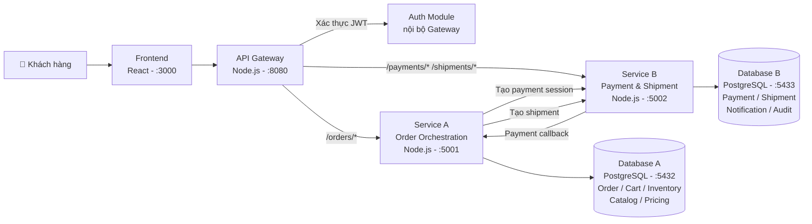

# System Architecture

> Tài liệu này được hoàn thành dựa trên kết quả phân tích từ [Analysis and Design — DDD](analysis-and-design-ddd.md).
> Hệ thống được thiết kế cho quy trình **Đặt hàng quần áo trực tuyến** trong lĩnh vực thương mại điện tử thời trang.

**Tài liệu tham khảo:**
1. *Service-Oriented Architecture: Analysis and Design for Services and Microservices* — Thomas Erl (2nd Edition)
2. *Microservices Patterns: With Examples in Java* — Chris Richardson
3. *Bài tập — Phát triển phần mềm hướng dịch vụ* — Hung Dang (available in Vietnamese)

---

## 1. Pattern Selection

| Pattern | Selected? | Business/Technical Justification |
|---------|-----------|----------------------------------|
| API Gateway | ✅ | Tất cả request từ Frontend đều đi qua Gateway để xác thực (Auth Utility) và điều hướng đến Service A hoặc Service B. Tránh lộ địa chỉ nội bộ các service. |
| Database per Service | ✅ | Service A (Order/Inventory) và Service B (Payment/Shipment) có domain dữ liệu khác nhau, cần độc lập hoàn toàn về schema và khả năng scale. |
| Shared Database | ❌ | Không dùng — vi phạm tính độc lập của microservices; khó scale từng service riêng lẻ. |
| Saga (Orchestration) | ✅ | Quy trình đặt hàng gồm nhiều bước liên tiếp (giữ tồn kho → tạo đơn → thanh toán → giao hàng). Service A đóng vai Orchestrator điều phối toàn bộ, đảm bảo rollback (hoàn trả tồn kho) khi thanh toán thất bại. |
| Event-driven / Message Queue | ❌ | Giai đoạn MVP sử dụng REST đồng bộ cho đơn giản. Có thể nâng cấp lên Message Queue (RabbitMQ/Kafka) ở giai đoạn sau. |
| CQRS | ❌ | Không cần thiết ở quy mô MVP; có thể áp dụng khi cần tối ưu truy vấn lịch sử đơn hàng lớn. |
| Circuit Breaker | ❌ | Chưa triển khai ở MVP; cân nhắc khi Service B (Payment) tích hợp với provider bên thứ 3. |
| Service Registry / Discovery | ❌ | Docker Compose DNS đã đảm nhận việc phân giải tên service nội bộ; không cần Service Registry riêng. |
| Health Check Endpoint | ✅ | Mọi service bắt buộc expose `GET /health` để Docker Compose kiểm tra trạng thái và đảm bảo tính Availability theo yêu cầu phi chức năng. |

> Reference: *Microservices Patterns* — Chris Richardson, Chương Saga, Data Management, và Communication Patterns.

---

## 2. System Components

| Component | Responsibility | Tech Stack | Port |
|-----------|----------------|------------|------|
| **Frontend** | Giao diện đặt hàng, hiển thị giỏ hàng, trạng thái đơn | React / Next.js | 3000 |
| **Gateway** | Xác thực token (Auth Utility), định tuyến request đến Service A/B | Node.js / Express | 8080 |
| **Service A** | Điều phối quy trình đặt hàng (Orchestration Saga), quản lý Đơn hàng, Giỏ hàng, Tồn kho, Catalog, Pricing | Node.js / Express | 5001 |
| **Service B** | Xử lý thanh toán (Payment Session, Callback), tạo vận đơn (Shipment), gửi thông báo, ghi audit | Node.js / Express | 5002 |
| **Database A** | Lưu trữ dữ liệu Order, Cart, Inventory, Product Catalog | PostgreSQL | 5432 |
| **Database B** | Lưu trữ dữ liệu Payment, Shipment, Notification, AuditLog | PostgreSQL | 5433 |

---

## 3. Communication

### Inter-service Communication Matrix

| From → To | Service A | Service B | Gateway | Database A | Database B |
|-----------|-----------|-----------|---------|------------|------------|
| **Frontend** | ❌ | ❌ | ✅ REST (HTTPS) | ❌ | ❌ |
| **Gateway** | ✅ REST (proxy /orders/*) | ✅ REST (proxy /payments/*, /shipments/*) | — | ❌ | ❌ |
| **Service A** | — | ✅ REST (tạo payment session, tạo shipment) | ❌ | ✅ Read/Write | ❌ |
| **Service B** | ✅ REST (callback kết quả thanh toán) | — | ❌ | ❌ | ✅ Read/Write |

> Giao thức: Tất cả gọi nội bộ dùng **HTTP/REST JSON**. Service B gọi ngược vào Service A qua endpoint callback để thông báo kết quả thanh toán.

---

## 4. Architecture Diagram



> Lưu ý: Các module phụ trợ (Auth, Cart, Catalog, Pricing, Notification, Audit) được tổ chức thành **module nội bộ** trong Service A hoặc Service B thay vì service độc lập, nhằm phù hợp quy mô MVP với 2 backend container.

---

## 5. Deployment

- Tất cả service được container hóa bằng **Docker**
- Điều phối bằng **Docker Compose**
- Khởi động toàn bộ hệ thống bằng một lệnh duy nhất:

```bash
docker compose up --build
```

### Cấu hình môi trường
- Sử dụng file `.env` cho toàn bộ biến cấu hình (thông tin kết nối DB, JWT secret, ports...)
- Không hardcode bất kỳ thông tin nhạy cảm nào trong source code

### Health Check
Mọi service đều expose endpoint kiểm tra trạng thái:

```
GET /health → { "status": "ok" }
```
